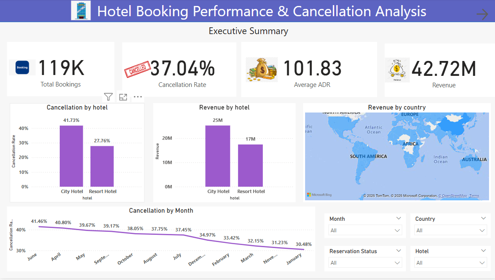
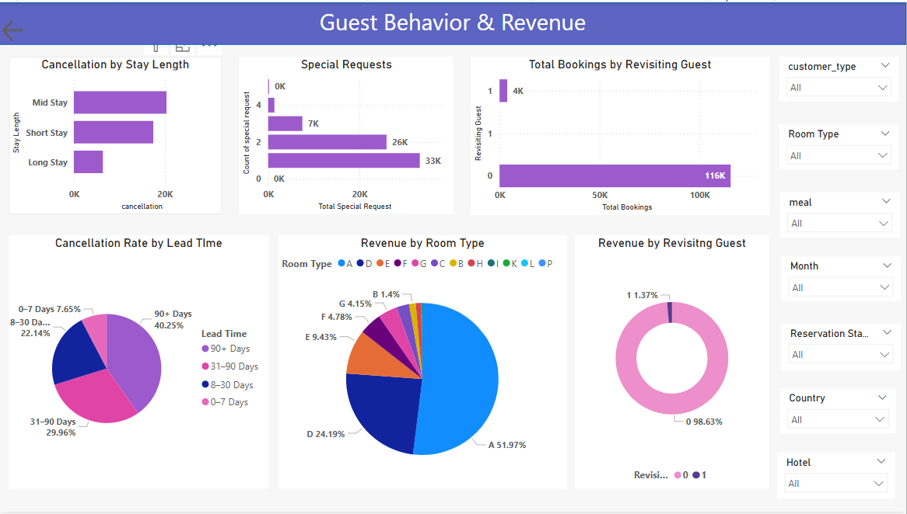

# Hotel_Booking

# 🏨 Hotel Booking Performance & Cancellation Analysis

This project is a comprehensive **data analysis of hotel booking behavior**, built using **Advanced SQL** and **Power BI dashboards**, to uncover patterns in cancellations, revenue trends, guest behavior, and room preferences.

  


---

## 📊 Project Overview

- 📌 **Dataset**: Hotel booking dataset from a fictional resort and city hotel
- 🧰 **Tools Used**: SQL Server, Power BI, DAX
- 🎯 **Goal**: Understand cancellation trends, revenue loss, guest behavior, and booking patterns to help hotels make better operational decisions.

---

## 🔍 Key Questions Answered

1. What is the overall cancellation rate, and how does it differ by hotel?
2. Which countries and customer segments cancel the most?
3. How do lead time, special requests, or stay duration affect cancellations?
4. What is the revenue lost due to cancellations?
5. Who are the most loyal guests?
6. Which room types and market segments drive revenue?

---

## 🧠 Insights from Analysis

### 💼 Executive Summary (Page 1)
- **Total Bookings**: 119K | **Cancellation Rate**: 37.04% | **Revenue**: $42.72M
- **City Hotel** has a significantly higher cancellation rate (41.73%) than Resort Hotel (27.76%).
- Most revenue (~$25M) is generated by the City Hotel, despite the high cancellations.
- Bookings from **June to May** have higher cancellation rates than the rest of the year.
- **Country-wise mapping** shows that certain regions contribute more to revenue and cancellation risk.

### 🧍 Guest Behavior & Revenue (Page 2)
- **Short Stays** and **0–7 day lead times** have the **lowest cancellation rates**, while long lead times (90+ days) have the **highest (40.25%)**.
- Guests with **more special requests** tend to cancel **less** (suggesting stronger intent).
- **Only 1.37% of bookings are from repeat guests**, but they generate consistent revenue and are more loyal.
- Room types **A and D** dominate revenue generation (over 75% combined).
- Revenue and cancellation behavior varies heavily by **meal plan**, **room assignment mismatch**, and **customer type**.

---

## 💻 SQL Logic Highlights

See the [`hotel_booking.sql`](./hotel_booking.sql) file for full queries.

### 🔧 Key SQL Analyses:
- Cancellation Rate by Hotel, Month, Country
- Revenue Lost vs. Kept (based on cancellations)
- Special Requests, Repeated Guests & Loyalty
- Booking Cleanliness (Room mismatch rate)
- Lead Time & Stay Duration Segmentation
- Monthly Booking Trends & Seasonality
- Daily Rolling Revenue Trend (7-day window)

> All queries use **CTEs, CASE statements, subqueries**, and **aggregations** — showcasing advanced SQL proficiency.

---

## 📈 Power BI Dashboard Features

- ✅ **KPIs**: Bookings, Cancellation Rate, Revenue, ADR
- 🧭 Filters by Month, Hotel, Country, Reservation Status, Customer Type
- 📉 Visuals: Bar charts, Pie charts, Line graphs, Donut charts, Maps
- 📦 Dual-page layout:  
  - Page 1: Executive Summary  
  - Page 2: Guest Behavior Deep Dive

---

## 📁 File Structure

```bash
📦 Hotel_Booking_Analysis
├── hotel_booking.sql           # SQL file for all analysis queries
├── PowerBI_Dashboard.pbix      # Power BI report file (optional)
├── executive_summary.png             # Executive Summary page
├── guest_behavior.png             # Guest Behavior page
└── README.md                   # This file
```

---

## 📌 Skills Demonstrated

- Advanced SQL (CTEs, window functions, CASE, subqueries)
- Power BI Dashboard design & KPI storytelling
- Data modeling & DAX calculations
- Business communication via visual storytelling
- Exploratory data analysis & segmentation

---

## 🚀 How to Use

1. Run the SQL file to create analytical views.
2. Load the data into Power BI via **SQL Server connection or CSV export**.
3. Import DAX calculations (e.g. cancellation rate, stay bucket).
4. Interact with slicers to explore trends.

---

## 🏁 Final Thought

This project simulates a **real-world hotel chain scenario**, solving tangible business problems with advanced SQL and visual analytics. A great addition to your portfolio for **data analyst**, **BI developer**, or **analytics consultant** roles.
